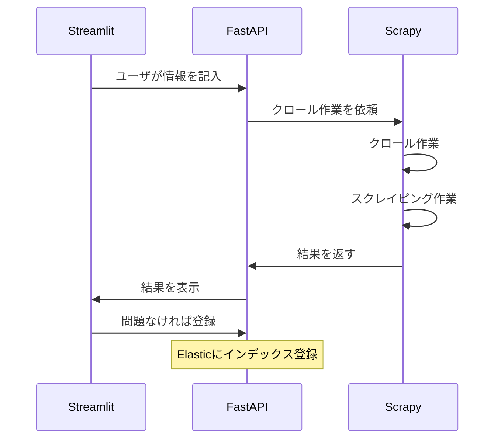
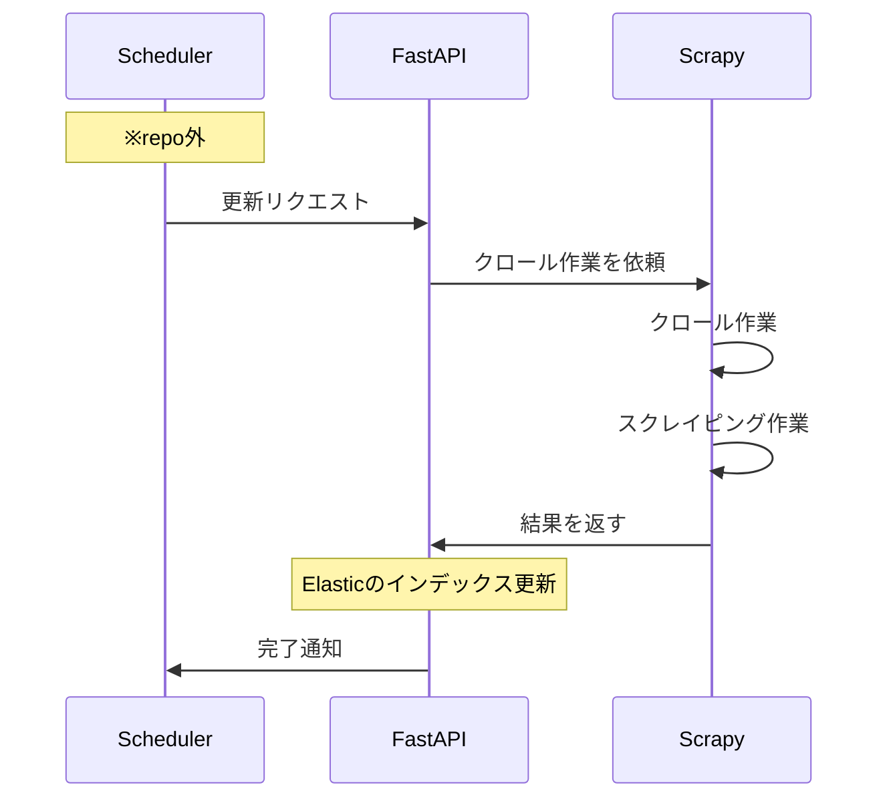

# Crawler App


## 登録プロセス

```mermaid
sequenceDiagram
    Streamlit->>FastAPI: ユーザが情報を記入
    FastAPI->>Scrapy: クロール作業を依頼
    Scrapy->>Scrapy: クロール作業
    Scrapy->>Scrapy: スクレイピング作業
    Scrapy->>FastAPI: 結果を返す
    FastAPI->>Streamlit: 結果を表示
    Streamlit->>FastAPI: 問題なければ登録
    Note over FastAPI: Elasticにインデックス登録
```
　
## インデックス更新プロセス

```mermaid
sequenceDiagram
    Note over Scheduler: ※repo外
    Scheduler->>FastAPI: 更新リクエスト
    FastAPI->>Scrapy: クロール作業を依頼
    Scrapy->>Scrapy: クロール作業
    Scrapy->>Scrapy: スクレイピング作業
    Scrapy->>FastAPI: 結果を返す
    Note over FastAPI: Elasticのインデックス更新
    FastAPI->>Scheduler: 完了通知
```


## 実行方法
個別でデプロイする場合
- fastAPI
```
cd fastapi
uvicorn back:app --reload
```

- Streamlit
```
streamlit run streamlit/front.py
```

- Scrapy
```
```